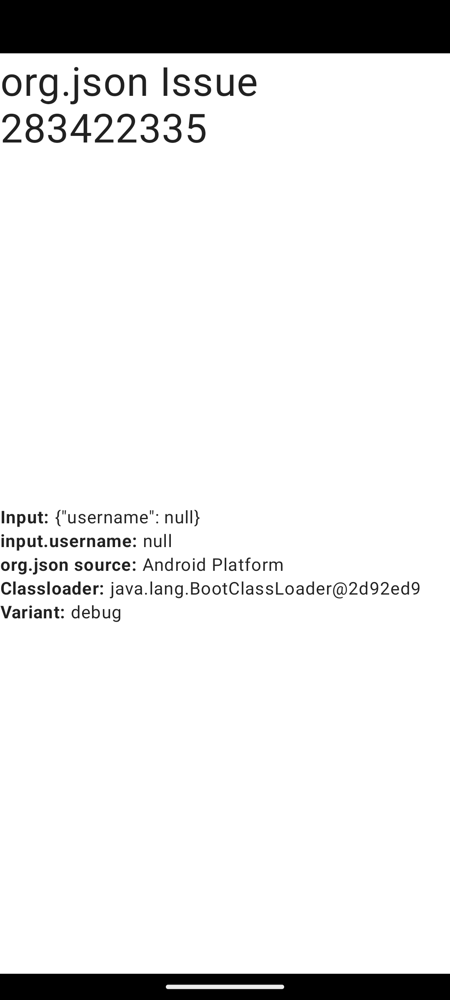
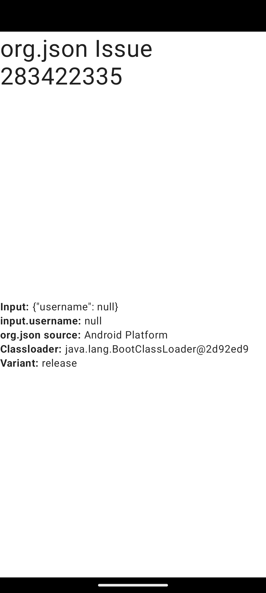
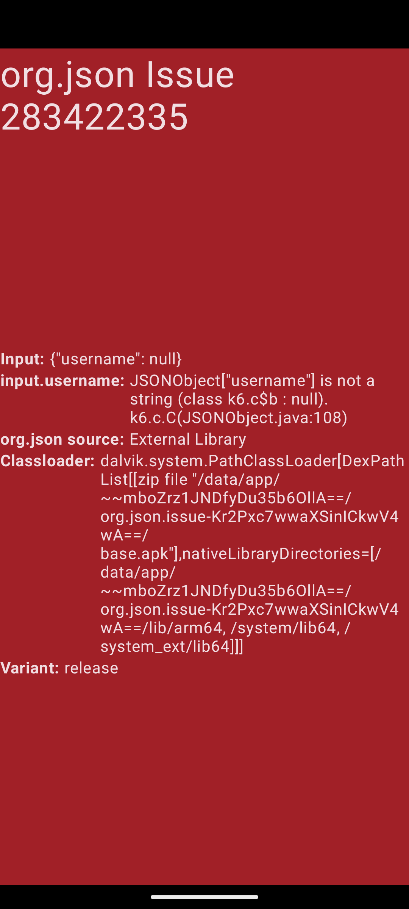

# org.json.issue

Minimal reproduction of an unexplained issue described in [Issue Tracker 283422335][1].

[1]: https://issuetracker.google.com/issues/283422335

## Issue

### Steps to reproduce

1. Sync and run the application in both `debug` and `release` variants.
2. Comment out / remove the dependency on `com.pubnub:pubnub-kotlin:7.4.2` in `:module-b`.
   * This pulls in  `org.json:json:20230227` transitively.
3. Sync and run the application in both `debug` and `release` variants.

### Expected results

`org.json.JSONObject` from the Android platform is used in all four cases.

### Actual results

`org.json.JSONObject` from the Android platform is only used in the following cases:

1. `debug` with PubNub dependency.
2. `debug` without PubNub dependency.
3. `release` without PubNub dependency.

However in the following case (the most important one) `org.json.JSONObject` comes from 
and external library dependency.

## Why is this important?

As noted in the issue report the behaviour of `JSONObject::getString` with respect to `null` 
values is different between the Android Platform version and the external library version. 
This behaviour difference can cause application crashes which can be very difficult to understand 
since Android Studio takes you to the Android Platform version of `JSONOBject`.

## Notes

This is _probably_ some weird Proguard / R8 issue here or a niche issue in our project setup. 
